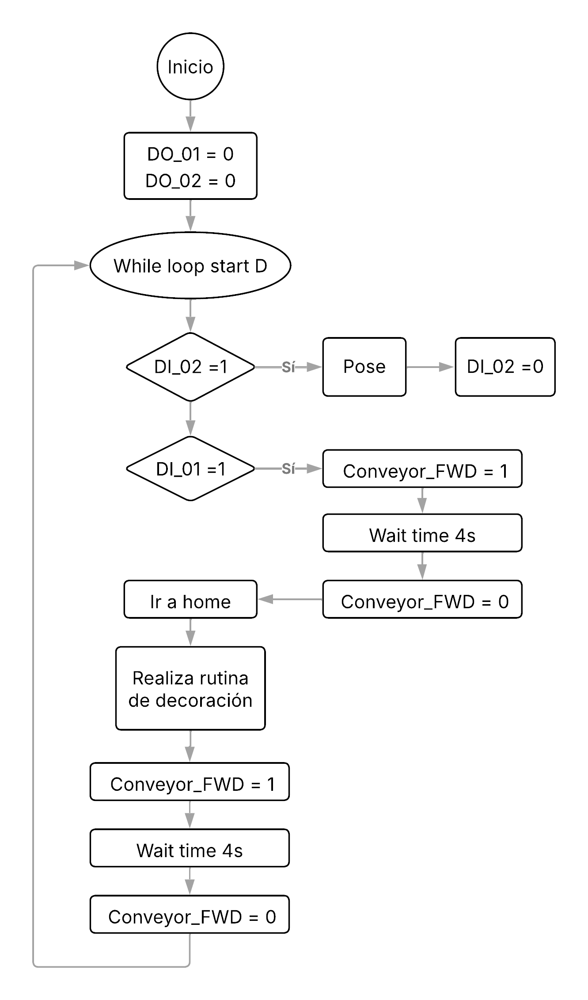
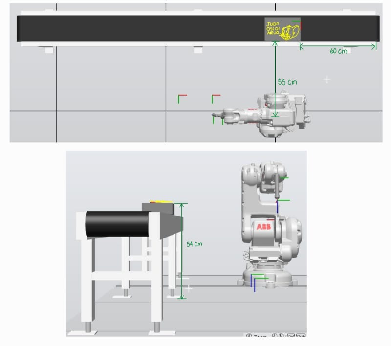
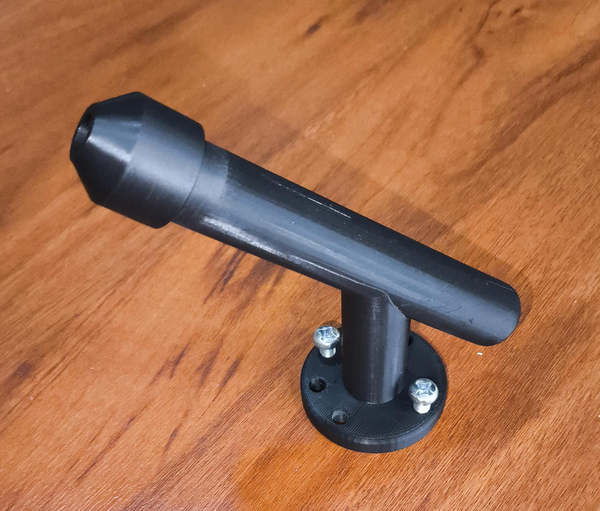
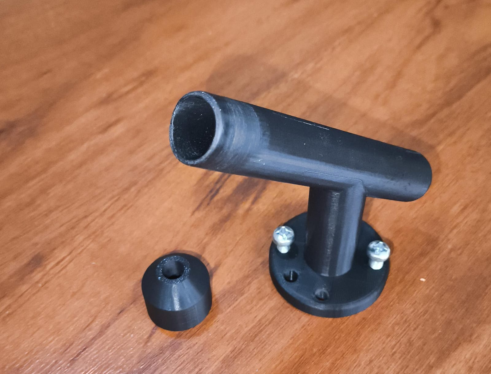
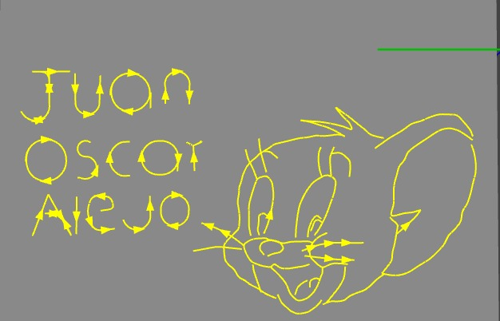
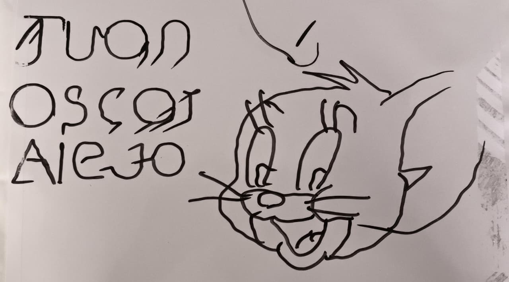

# Informe 1

## Solución planteada

Descripcion detallada de la solucion planteada.
### Restricciones
Segun las restricciones:

 -El tamaño de la torta es para 20 personas
 
 -Las trayectorias a desarrollar deberán realizarse en un rango de velocidades entre 100 y 1000.
 
 -La zona tolerable de errores máxima debe ser de z10.
 
 -El movimiento debe partir de una posición home especificada (puede ser el home del robot) y realizar la trayectoria de cada palabra y decoración con un trazo continuo. El movimiento debe finalizar en la misma posición de home en la que se inició.
 
 -La decoración de la torta debe ser realizada sobre una torta virtual.
 
 -Los nombres deben estar separados.
 

### Solución 

Nuestra solución plantea una torta rectagunlar de dimensiones XXXXX cm que alcanza para 20 personas, los nombres que escribiremos son de los 3 integrantes (juan, oscar y alejo) junto a un dibujo del raton jerry animado, la velocidad escogida es de 100 para tener un menor velocidad pero mayor precision en la escritura por el marcador, 

## Diagrama de flujo 
Diagrama de flujo de acciones del robot.
 
## Plano de planta
Plano de planta de la ubicacion de cada uno de los elementos.
 
## Funciones utilizadas
Descripcion de las funciones utilizadas.

 -SetDO: Activa o desactiva una salida digital

 -WaitTime: Pausa la ejecución durante t segundos

 -Conveyor_FWD: Controlan el transportador (conveyor), Conveyor_FWD lo enciende hacia adelante.

 -Conveyor_STOP: Controlan el transportador (conveyor), Conveyor_STOP lo detiene.

 -MoveJ: Movimiento articular (Joint) hacia objetivo.

 -MoveL: Movimiento lineal hacia objetivo.

 -MoveC: Movimiento circular pasando por objetivo1 y terminando en objetivo2.

 -PROC / ENDPROC: Define un procedimiento (subrutina).

 -WHILE: Bucle repetitivo.

 -IF / ENDIF: Condicional simple.

## Diseño de la herramienta

### Objetivo de la herramienta
La herramienta diseñada tiene como objetivo principal permitir que el robot industrial IRB 140 pueda sostener y manipular un marcador o plumón para realizar la decoración de tortas virtuales o reales. Adicionalmente, el diseño incorpora un resorte que actúa como mecanismo de compensación ante posibles errores en la calibración de la herramienta o desviaciones propias del robot. Este resorte proporciona una tolerancia mecánica, asegurando que, incluso si existen pequeñas imprecisiones en la posición del robot o en el Tooldata, el marcador mantenga un contacto adecuado con la superficie de trabajo y permita un trazo continuo y preciso durante la ejecución de las trayectorias.
### Diseño conceptual herramienta
La herramienta diseñada es un soporte para marcador, destinada a sostener de manera segura un plumón o marcador en el flanche del robot industrial IRB 140. La herramienta tiene una forma cilíndrica y se compone de dos piezas principales:

**1. Cuerpo principal**:

- Incluye la base que se fija al flanche del robot mediante cuatro huecos de sujeción, garantizando un acople estable y seguro.

- Contiene un compartimento donde se inserta el marcador, formando un único conjunto con la base para facilitar la manipulación y la estabilidad del instrumento.

**2. Tapa**:

- Se ensambla al cuerpo principal mediante un sistema a presión, permitiendo un cierre seguro pero desmontable.

- Su función es mantener el marcador firme en su posición durante el movimiento del robot, evitando desplazamientos que puedan afectar la precisión de las trayectorias.

### Proceso de construcción
La herramienta fue diseñada en el software Fusion360 y se fabricó mediante impresión 3D con material PLA, sin presentar dificultades durante la fabricación. El único ajuste realizado fue lijar ligeramente la zona de inserción de la tapa, asegurando un ensamblaje a presión correcto y un acople firme del marcador durante el movimiento del robot.

   |

### Calibración herramienta
La calibración de la herramienta se realizó posicionando el marcador montado en el flanche del robot sobre un punto de referencia común desde cuatro posiciones diferentes: frente, trasera, lado izquierdo y lado derecho. Este procedimiento permitió determinar con precisión el Tooldata, asegurando que el robot reconociera correctamente la posición y orientación de la punta del marcador durante la ejecución de las trayectorias.

## Codigo RAPID
El código RAPID desarrollado para este laboratorio tiene como objetivo ejecutar las trayectorias necesarias para la decoración de la torta virtual. Para ello, se diseñaron una serie de paths definidos manualmente y ajustados de manera iterativa hasta lograr el patrón de decoración deseado.

Cada trayectoria se encuentra organizada dentro del módulo llamado Module1, donde se establecen los puntos de inicio, fin y las posiciones intermedias del marcador sobre la superficie de trabajo. El código incluye:

**1. Rutinas de movimiento del robot:**

MoveL y MoveJ para movimientos lineales y conjuntos de articulaciones, respectivamente.

Las trayectorias se ejecutan de forma secuencial para asegurar trazos continuos y precisos.

**2. Control de condiciones con IF:**

Se implementa un condicional IF para iniciar la banda transportadora y la rutina de decoración, asegurando que el robot solo comience la operación cuando las condiciones sean correctas.

**3. Resultado en RobotStudio:**

La ejecución del código genera en la simulación de RobotStudio el diseño final de la decoración, reflejando fielmente la disposición de letras y patrones definidos en las trayectorias.

**4. Resultado Practica**

A continuación se muestra una imagen del resultado obtenido en la práctica real:

## Video
Link del video 
https://youtu.be/Crd41DUmBFk

