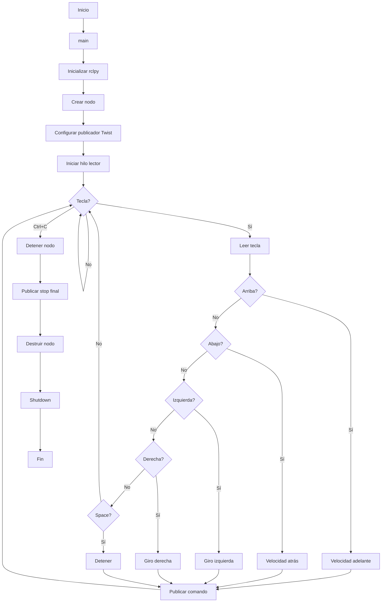

# Laboratorio 04 – Control de Turtlesim con ROS2 Humble

## Descripción breve / Objetivos

Este proyecto consiste en controlar una tortuga dentro de ROS2 utilizando el teclado (sin hacer uso del paquete `turtle_teleop_key`). Además, se implementa la funcionalidad para dibujar las iniciales del nombre mediante teclas específicas. El objetivo principal es practicar el uso de ROS2, Linux y Python en el desarrollo de nodos, publishers y subscribers.

## Requisitos y entorno

- **ROS 2 Humble** instalado.
- **Turtlesim** instalado.
- **Workspace `my_turtle_controller`** creado.

## Procedimiento

### Paso 1

El primer paso para la realización de este laboratorio fue instalar Linux. En nuestro caso, optamos por configurar una máquina virtual utilizando **VMware Workstation Player**x, siguiendo el tutorial disponible en el siguiente repositorio: https://github.com/labsir-un/ROB_Intro_Linux

### Paso 2 

El siguiente paso consistió en la instalación de ROS2. Para ello, seguimos el tutorial proporcionado en el siguiente repositorio: https://github.com/labsir-un/ROB_Intro_ROS2_Humble. Este proceso incluyó la instalación de **Visual Studio Code**, **Terminator**, y la configuración del locale. Además, configuramos las fuentes de ROS2 Humble, realizamos la instalación de ROS2 Humble, y verificamos su funcionamiento ejecutando un ejemplo básico de talker-listener.

## Diagrama de flujo

### Codigo control manual
El codigo en mermaid es

### Codigo letras
