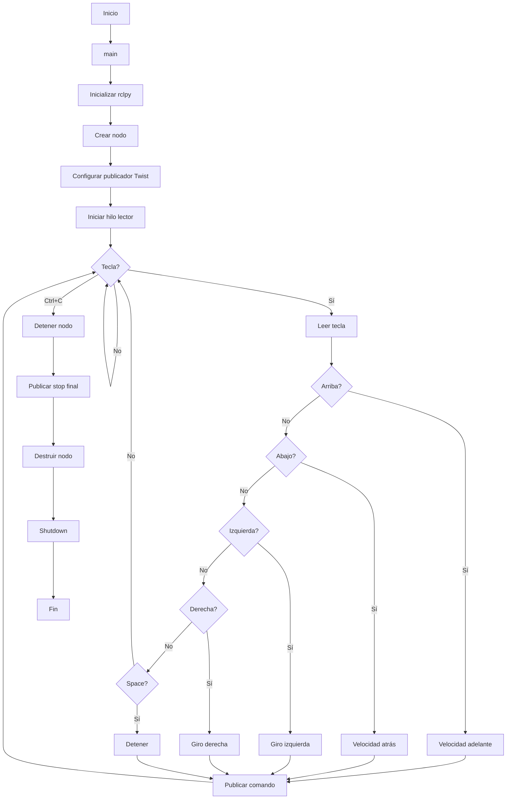
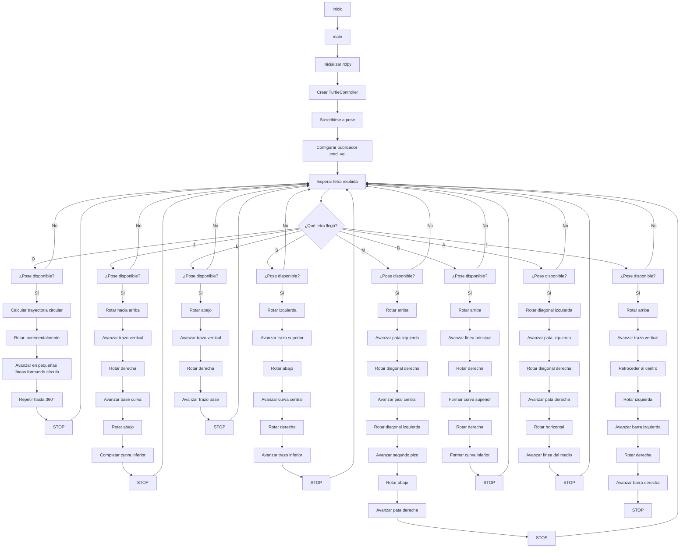

# Laboratorio 04 – Control de Turtlesim con ROS2 Humble
## Integrantes

- Juan Manuel Beltran Botello 
- Alejandro Mendivelso Torres
- Oscar Jhondairo Siabato Leon

  
## Descripción breve / Objetivos

Este proyecto consiste en controlar una tortuga dentro de ROS2 utilizando el teclado (sin hacer uso del paquete `turtle_teleop_key`). Además, se implementa la funcionalidad para dibujar las iniciales del nombre mediante teclas específicas. El objetivo principal es practicar el uso de ROS2, Linux y Python en el desarrollo de nodos, publishers y subscribers.

## Objetivo del Laboratorio

Este laboratorio tiene como objetivo proporcionar un aprendizaje práctico de tres elementos fundamentales:

1. **Tutoriales de Linux**: Comandos esenciales de consola para navegación, permisos, procesos y manejo de archivos.
2. **Tutoriales de ROS 2 Humble**: Estructura de nodos, tópicos, mensajes, y paquetes dentro de un `workspace`.
3. **Tutoriales de Turtlesim**: Uso del simulador y del tópico `/turtle1/cmd_vel` para controlar la velocidad lineal y angular.

## Resultados de Aprendizaje

- Comprender los conceptos básicos de ROS.
- Usar comandos fundamentales de Linux.
- Conectar nodos en Python dentro de ROS 2.
- Manipular la tortuga mediante código propio.

## Procedimiento

### Paso 1

El primer paso para la realización de este laboratorio fue instalar Linux. En nuestro caso, optamos por configurar una máquina virtual utilizando **VMware Workstation Player**x, siguiendo el tutorial disponible en el siguiente repositorio: https://github.com/labsir-un/ROB_Intro_Linux

### Paso 2 

1. **Configuración del entorno de desarrollo**:
   - Se configuró el sistema operativo Linux, incluyendo la instalación de los paquetes necesarios para el trabajo con ROS 2 Humble.
   - Se estableció un `workspace` en ROS 2 para gestionar los proyectos y nodos correspondientes.
   - Se instaló y configuró el simulador Turtlesim, asegurándose de que se pudieran controlar los movimientos de la tortuga mediante comandos en Python.

2. **Control de la tortuga con teclado**:
   - Se creó un script en Python (llamado `move_turtle.py`) para controlar el movimiento de la tortuga a través del teclado.
   - Se implementaron los controles para avanzar, retroceder, y girar a la izquierda y derecha utilizando las teclas de flecha.
   - Se optó por no usar el nodo `turtle_teleop_key` para garantizar que el control se hiciera de forma personalizada desde nuestro script.

3. **Dibujo automático de letras**:
   - Se creó un archivo `codigo_letras.prg` con las trayectorias específicas para cada letra (O, J, S, L, M, B, A, T).
   - Cada letra fue convertida a código ROS2, implementando una función independiente para cada una de ellas que movía la tortuga a lo largo de las trayectorias definidas.

4. **Integración y prueba de nodos**:
   - Se verificó la correcta comunicación entre los diferentes nodos utilizando los comandos `colcon build` y `ros2 run`.
   - Se ejecutaron pruebas de control de movimiento y dibujo para asegurar que todos los componentes funcionaran de manera integrada.

## Decisiones de Diseño

1. **Uso de ROS 2 Humble**:
   - Se eligió ROS 2 debido a su capacidad para manejar sistemas distribuidos y sus mejoras sobre ROS 1, incluyendo un mejor manejo de la latencia y mayor escalabilidad.
   - La decisión de trabajar con Python fue tomada por su facilidad de integración con ROS 2 y su sintaxis clara, lo cual facilita el desarrollo rápido de scripts.

2. **Control personalizado de la tortuga**:
   - Se optó por desarrollar el control de la tortuga desde cero sin usar el nodo `turtle_teleop_key` para asegurar un control más flexible y adaptado a nuestras necesidades. Esto permitió un mayor control sobre los movimientos y la incorporación de lógica personalizada para los movimientos de la tortuga.

3. **Estructura de las funciones de las letras**:
   - Cada letra fue implementada como una función independiente, lo que permitió modularizar el código y hacer que cada una fuera fácilmente reutilizable.
   - Esto facilita la extensión del proyecto para dibujar más letras o figuras en el futuro, simplemente añadiendo más funciones de dibujo.

4. **Uso de ROS 2 para integración**:
   - La elección de usar ROS 2 para la integración de nodos fue clave para garantizar la escalabilidad del proyecto, permitiendo que se pueda expandir a otros robots o sistemas en el futuro.
   - La comunicación entre nodos se facilitó utilizando mensajes ROS para controlar la tortuga y ejecutar los movimientos definidos.

## Funcionamiento General del Proyecto

El proyecto se basa en la interacción entre diferentes elementos: el sistema operativo Linux, el entorno ROS 2 Humble, y el simulador Turtlesim. El flujo general de funcionamiento es el siguiente:

1. **Inicialización**: Se construye el workspace y se configura el entorno ROS.
2. **Control de la tortuga**: Se ejecuta el script `move_turtle.py`, que escucha las teclas del teclado y envía comandos al nodo ROS correspondiente para controlar el movimiento de la tortuga.
3. **Dibujo de letras**: A medida que el script se ejecuta, se llaman las funciones correspondientes a las letras definidas en el archivo `codigo_letras.prg`, haciendo que la tortuga trace las letras sobre el espacio de trabajo.
4. **Verificación**: El sistema verifica que la comunicación entre nodos esté funcionando correctamente y asegura que los movimientos y dibujos de la tortuga se realicen con precisión.
   
## Diagrama de flujo

### Codigo control manual
El codigo en mermaid es

### Codigo letras

El codigo en mermaid es

