# Exposición Técnica Detallada: Ejecución y Arquitectura del Proyecto PhantomX Pincher

Este documento ofrece una explicación técnica profunda y exhaustiva sobre el funcionamiento, arquitectura y ejecución de las dos partes principales del proyecto: Clasificación Automática y Teleoperación Articular.

---

## Parte 1: Control Automático (Clasificación Interactiva)

Esta sección describe la arquitectura distribuida utilizada para dotar al robot de autonomía para clasificar figuras (cubos, cilindros, etc.) en sus respectivos contenedores.

### 1. Arquitectura de Software y Nodos
El sistema funciona mediante una arquitectura de nodos distribuidos en ROS 2 que se comunican asíncronamente.

#### **A. Nodo Lógico: `clasificador_node` (Python)**
Es el "cerebro" de la operación. No controla motores directamente, sino que orquesta la secuencia lógica.
*   **Función**: Implementa una **Máquina de Estados Finitos (FSM)** que gestiona paso a paso la misión de pick-and-place.
*   **Suscripción Principal**: 
    *   **Tópico**: `/figure_type`
    *   **Tipo**: `std_msgs/msg/String`
    *   **Propósito**: Recibe la señal de inicio (ej: "cubo"). Esto dispara la transición del estado `IDLE` al inicio de la secuencia.
*   **Gestión de Datos (`poses.yaml`)**:
    *   Al iniciarse, lee un archivo YAML que actúa como base de datos persistente de coordenadas espaciales.
    *   **Estructura**: Diccionario con claves (`caneca_roja`, `recoleccion`, etc.) y valores cartesianos (`x, y, z`) y de orientación (`roll, pitch, yaw`).
    *   Esto permite calibrar el robot editando un archivo de texto sin recompilar código.
*   **Control del Gripper**:
    *   Utiliza un **Action Client** (`ActionClient`) para comunicarse con el controlador del gripper.
    *   **Acción**: `gripper_trajectory_controller/follow_joint_trajectory`.
    *   **Lógica**: Envía un `JointTrajectoryPoint` con la posición deseada (`1.4` abierto, `0.5` cerrado) y espera confirmación (feedback) antes de pasar al siguiente estado de la máquina.

#### **B. Nodo de Comandancia: `commander` (C++)**
Actúa como puente entre la lógica de alto nivel y el planificador de movimientos profundos (MoveIt).
*   **Propósito**: Abstraer la complejidad de MoveIt para el nodo de Python. Recibe comandos simples ("ve a X,Y,Z") y los convierte en planes de movimiento complejos.
*   **Suscripción Critica**:
    *   **Tópico**: `/pose_command`
    *   **Tipo**: `phantomx_pincher_interfaces/msg/PoseCommand`
    *   **Estructura del Mensaje**:
        ```python
        float64 x
        float64 y
        float64 z
        float64 roll
        float64 pitch
        float64 yaw
        bool cartesian_path  # Define si el movimiento debe ser lineal estricto
        ```
*   **Interacción con MoveIt (`MoveGroupInterface`)**:
    1.  Recibe el mensaje `PoseCommand`.
    2.  Convierte los ángulos de Euler (Roll, Pitch, Yaw) a un **Cuaternión** (w, x, y, z) usando `tf2::Quaternion`, ya que ROS 2 opera internamente con cuaterniones para evitar el bloqueo de cardán (gimbal lock).
    3.  Establece el `PoseTarget` en el grupo de planificación "arm".
    4.  Invoca `move_group->plan()`: MoveIt calcula la Cinemática Inversa (IK) para encontrar los ángulos articulares necesarios.
    5.  Invoca `move_group->execute()`: Envía la trayectoria calculada a los controladores de bajo nivel.

### 2. Flujo de Ejecución Detallado (Pipeline)
1.  **Detección**: Un nodo externo de visión (simulado o real) publica string "pentagono" en `/figure_type`.
2.  **Decisión**: `clasificador_node` consulta su mapa interno: `{'pentagono': 'caneca_azul'}`.
3.  **Secuenciación**: La FSM inicia. Estado 1: `MOVING_TO_HOME`.
4.  **Publicación**: `clasificador_node` publica en `/pose_command` los valores de 'home' del YAML.
5.  **Planificación (IK)**: El nodo `commander` recibe el comando. Usa el plugin de cinemática (KDL o IKFast) para calcular los 4 ángulos de los servos.
6.  **Ejecución**: El controlador de trayectoria interpola el movimiento y mueve el robot.
7.  **Transición**: Un Timer en `clasificador_node` dispara el siguiente paso tras `TIME_MOVEMENT` segundos, enviando ahora la pose de `recoleccion`.

### 3. Conceptos Clave de ROS 2 y Robótica
*   **Cinemática Inversa (IK)**: Proceso matemático de calcular los ángulos de las articulaciones ($\theta_1, \theta_2, \theta_3, \theta_4$) necesarios para situar el efector final en una coordenada $(x, y, z)$ con una orientación específica. El `commander` delega esto a MoveIt.
*   **Jacobiano**: Matriz que relaciona las velocidades articulares con la velocidad lineal y angular del efector final. MoveIt la utiliza para garantizar movimientos suaves y detectar singularidades (posiciones donde el robot pierde movilidad).
*   **Trayectorias Cartesianas**: Cuando `cartesian_path=True`, el planificador no solo busca el punto final, sino que genera "waypoints" intermedios muy cercanos entre sí en una línea recta perfecta, esencial para movimientos de inserción o aproximación precisa.

---

## Parte 2: Teleoperación por Teclado (Control Articular Directo)

Esta parte prescinde de la planificación automática y otorga control total de bajo nivel al operador, ideal para maniobras delicadas o recuperación de errores.

### 1. Arquitectura del Nodo `teleop_joint_node.py`
A diferencia del control automático, este nodo opera en el **Espacio Articular (Joint Space)** directamente.

#### **A. Captura de Entrada (Non-blocking I/O)**
*   Utiliza las librerías `termios` y `tty` de Linux para poner la terminal en modo "raw". Esto permite capturar pulsaciones de teclas individuales sin necesidad de presionar "Enter" y sin bloquear el bucle de ejecución del programa.
*   Mapeo de teclas:
    *   W/S: Joint 2 (Hombro)
    *   A/D: Joint 1 (Base - Rotación)
    *   Q/E: Joint 3 (Codo)
    *   Z/X: Joint 4 (Muñeca)

#### **B. Control de Motores (Action Client Rápido)**
En lugar de un tópico simple, usa un Action Client para máxima robustez, pero optimizado para velocidad.
*   **Cliente**: `joint_trajectory_controller/follow_joint_trajectory`.
*   **Generación de Trayectoria**:
    *   Cada vez que se presiona una tecla, se actualiza un array local `joint_positions`.
    *   Se crea un `JointTrajectoryPoint` con **un solo punto**.
    *   **Critical**: El parámetro `time_from_start` se configura en un valor muy bajo (milisegundos). Esto fuerza al controlador a alcanzar la nueva posición casi instantáneamente, dando la sensación de respuesta en tiempo real al usuario.

#### **C. Sincronización de Estado (`/joint_states`)**
*   Al iniciar, el nodo se suscribe una única vez a `/joint_states`.
*   **Objetivo**: Leer la configuración física real del robot antes de enviar el primer comando.
*   **Por qué**: Si el nodo iniciara asumiendo que el robot está en ceros (0,0,0,0) pero el robot físico está doblado, el primer comando causaría un "salto" violento y peligroso. La sincronización inicializa el estado virtual del nodo con la realidad física.

#### **D. Integración de Hardware Externo (Arduino + Relé)**
Para controlar la ventosa (que no es un servo Dynamixel y no aparece en el bus ROS estándar), se implementa un driver híbrido.
*   **Librería**: `pyserial`.
*   **Puerto**: `/dev/ttyACM0` (típicamente).
*   **Protocolo**: Comunicación Serial (UART) a 9600 baudios.
    *   Envía byte `'O'` -> Arduino activa pin digital -> Relé cierra circuito -> Bomba Vacío ON.
    *   Envía byte `'P'` -> Arduino desactiva pin -> Bomba Vacío OFF.
*   Este diseño demuestra cómo ROS 2 puede coexistir e integrar hardware embebido simple ("micro-ROS" conceptual) dentro de un nodo de alto nivel.

### 2. Archivos Críticos y Configuración

*   **`phantomx_pincher_arm.xacro`**:
    *   Define los límites físicos (`limit lower="..." upper="..."`). El nodo de teleoperación no valida colisiones complejas, por lo que confía en que los límites del URDF y del hardware protejan al robot de autocolisiones básicas.
    *   Integra visualmente la malla `gripper_neumatico.stl` para que el operador vea la herramienta correcta en RViz.
*   **`teleop_joint_node.py`**:
    *   Contiene la lógica de interpolación "suave" para la función "Go to Home". Cuando el usuario presiona Espacio, el nodo no envía el comando final inmediatamente. En su lugar, calcula 100 pasos intermedios y los envía secuencialmente en un bucle (`time.sleep`), generando una animación fluida generada por software.

### 3. Valores Clave para Operación
*   **Step Size (Resolución)**: `0.008 radianes` (~0.45 grados).
    *   Un valor menor daría más precisión pero haría el movimiento muy lento.
    *   Un valor mayor haría el robot "saltar" demasiado, dificultando alinear la ventosa con un objeto.
*   **Posiciones Predefinidas (Home)**:
    *   `HOME` (Horizontal): `[0.0, 0.0, 0.0, 0.0]`. Centro de gravedad extendido (mayor torque en servos base).
    *   `HOME2` (Vertical): `[0.0, 0.0, 1.57, 1.57]`. Configuración de "vela" o reposo, minimiza el esfuerzo de retención (holding torque) debido a que la gravedad actúa alineada con los eslabones.

---
**Resumen de Interacción de Sistemas:**
Usuario/Cámara ⮕ Nodo Python (Lógica) ⮕ Nodo C++ (Geometría/MoveIt) ⮕ Controladores ROS 2 ⮕ Hardware (Dynamixel/Arduino).


stateDiagram-v2
    direction TB
    
    %% Status
    [*] --> IDLE
    
    %% Initialization
    IDLE --> MOVING_TO_HOME_START: Receive /figure_type
    MOVING_TO_HOME_START --> OPENING_GRIPPER_START: Success
    OPENING_GRIPPER_START --> MOVING_TO_PICKUP: Gripper Open
    
    %% Retrieval
    MOVING_TO_PICKUP --> CLOSING_GRIPPER: At Pickup Zone
    CLOSING_GRIPPER --> MOVING_TO_HOME_WITH_OBJECT: Gripper Closed
    
    %% Decision & Transport
    state decision_point <<choice>>
    MOVING_TO_HOME_WITH_OBJECT --> decision_point: Object Lifted
    
    decision_point --> MOVING_TO_BIN: Direct (Cube/Rect/Pent/Cyl)
    decision_point --> MOVING_TO_SAFE_POS_1: Others (Via Safe Points)
    
    %% Safe Path (Optional)
    MOVING_TO_SAFE_POS_1 --> MOVING_TO_SAFE_POS_2
    MOVING_TO_SAFE_POS_2 --> MOVING_TO_SAFE_POS_3
    MOVING_TO_SAFE_POS_3 --> MOVING_TO_SAFE_POS_4
    MOVING_TO_SAFE_POS_4 --> MOVING_TO_BIN
    
    %% Delivery
    MOVING_TO_BIN --> OPENING_GRIPPER_DROP: At Bin
    
    %% Return Logic
    state return_decision <<choice>>
    OPENING_GRIPPER_DROP --> return_decision: Object Dropped
    
    return_decision --> RETURNING_TO_HOME_END: Direct Return
    return_decision --> RETURNING_TO_SAFE_POS_4: Complex Return
    
    %% Completion
    RETURNING_TO_HOME_END --> COMPLETED
    COMPLETED --> IDLE: Sequence Finished

    # Implementación de Componentes 3D en XACRO (Canecas y Gripper)

A continuación se explica técnicamente cómo se integraron los modelos visuales 3D (meshes) de las Canecas y el Gripper Neumático dentro de la descripción del robot (URDF/XACRO).

## 1. Integración del Gripper Neumático (Ventosa)

**Archivo:** `phantomx_pincher_arm.xacro`

La ventosa no es una articulación móvil motorizada estándar del robot (como los motores Dynamixel), por lo que se modeló como un **eslabón rígido (Fixed Link)** adherido al servo de la muñeca.

### Código Implementado:
```xml
<!-- Eslabón Visual (Sin propiedades inerciales complejas) -->
<link name="${prefix}suction_cup_link">
  <visual>
    <geometry>
      <!-- Carga del archivo STL personalizado -->
      <mesh filename="package://phantomx_pincher_description/meshes/STL/gripper_neumatico.stl" scale="0.001 0.001 0.001"/>
    </geometry>
    <material name="black"/>
  </visual>
</link>

<!-- Unión Fija al Robot -->
<joint name="${prefix}gripper_to_suction_joint" type="fixed">
    <!-- El "padre" es el servo de la muñeca, lo que hace que la ventosa se mueva con él -->
    <parent link="${prefix}gripper_servo_link"/>
    <child link="${prefix}suction_cup_link"/>
    <!-- Ajuste manual de posición (XYZ) y rotación (RPY) para alinear la malla -->
    <origin xyz="-0.056 -0.01 -0.1" rpy="${pi/2} ${3*pi/2} ${pi}"/>
</joint>
```

### Explicación Lógica:
1.  **Parent Link (`gripper_servo_link`)**: Se eligió el eslabón del servo de la muñeca como punto de anclaje. Esto garantiza que cuando el robot mueve la muñeca (pitch), la ventosa se mueve solidariamente.
2.  **Transformada (`origin`)**: Se realizó un ajuste fino de `xyz` y `rpy` (Roll, Pitch, Yaw). Esto fue necesario porque el origen del archivo STL no coincidía perfectamente con el eje del motor, por lo que se desplazó y rotó hasta que visualmente encajó en el modelo en RViz.
3.  **Scale**: Se aplicó `0.001` porque los STLs suelen exportarse en milímetros, pero ROS trabaja estrictamente en metros.

---

## 2. Integración de las Canecas (Entorno)

**Archivo:** `kit.xacro`

Las canecas son elementos estáticos del entorno (no parte del robot), por lo que se definieron en un archivo separado (`kit.xacro`) que describe la "celda de manufactura" o mesa de trabajo.

### Estrategia de Implementación:
Se usó un eslabón maestro llamado `baseFija_link` (la madera/mesa) como referencia. Todas las canecas se definen con **joints fijos (`type="fixed"`)** relativos a esta base.

### Código Implementado (Ejemplo Caneca Roja):
```xml
<!-- Definición de la Caneca Izquierda (Roja) -->
<link name="canecaLateralIzquierda_link">
  <visual>
    <geometry>
      <!-- Reutilización del mismo archivo STL para todas las canecas -->
      <mesh filename="package://phantomx_pincher_description/meshes/STL/canecaGrande.stl"
            scale="0.001 0.001 0.001" />
    </geometry>
    <!-- El material define el color diferenciador -->
    <material name="red" />
  </visual>
  <collision>
    <!-- Se añade colisión para que MoveIt sepa que no puede atravesarla -->
    <geometry>
      <mesh filename="package://phantomx_pincher_description/meshes/STL/canecaGrande.stl"
            scale="0.001 0.001 0.001" />
    </geometry>
  </collision>
</link>

<!-- Posicionamiento -->
<joint name="base_canecaLateralIzquierda_joint" type="fixed">
  <parent link="baseFija_link" />
  <child link="canecaLateralIzquierda_link" />
  <!-- Coordenadas exactas medidas desde el centro de la base -->
  <origin xyz="-0.0135 0.12775 0.016" rpy="0 0 0" />
</joint>
```

### Puntos Clave:
1.  **Reutilización de Meshes**: Se usa el mismo archivo `canecaGrande.stl` para las 4 canecas.

```mermaid
stateDiagram-v2
    direction LR

    [*] --> IDLE

    IDLE --> MOVING_TO_HOME_START: Recibe '/figure_type'
    MOVING_TO_HOME_START --> OPENING_GRIPPER_START: Llegada a Home
    OPENING_GRIPPER_START --> MOVING_TO_PICKUP: Gripper Abierto
    MOVING_TO_PICKUP --> CLOSING_GRIPPER: En Posición de Recolección
    CLOSING_GRIPPER --> MOVING_TO_HOME_WITH_OBJECT: Objeto Sujeto

    state decision_point <<choice>>
    MOVING_TO_HOME_WITH_OBJECT --> decision_point: En Home (con objeto)
    decision_point --> MOVING_TO_BIN: Cubo/Cilíndro/Rect/Pentágono
    decision_point --> MOVING_TO_BIN: Otros

    MOVING_TO_BIN --> OPENING_GRIPPER_DROP: En Caneca Destino

    state return_decision <<choice>>
    OPENING_GRIPPER_DROP --> return_decision: Objeto Soltado
    return_decision --> RETURNING_TO_HOME_END: Retorno

    RETURNING_TO_HOME_END --> COMPLETED
    COMPLETED --> IDLE: Listo para nueva figura


```

2.  **Materiales**: Se diferencia cada una asignando una etiqueta `<material name="red"/>`, `<material name="blue"/>`, etc., definidas en la cabecera del archivo.
3.  **Colisiones**: A diferencia de elementos puramente decorativos, aquí se añadió la etiqueta `<collision>`. Esto es **crítico** para MoveIt: permite que el planificador de trayectorias detecte la caneca como un obstáculo y calcule rutas que eviten golpearla al depositar objetos.


